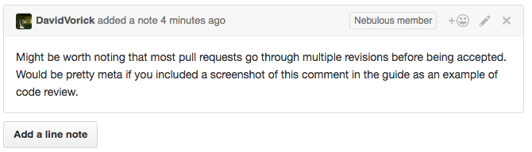

# Contributing to Sia

#### Table of Contents
* [Get started with Go](#go)
  * [Install Go](#install-go)
  * [Learn Go]("learn-go")
* [Build Sia](#build-sia)
* [Contribute to the codebase](#contribute)
  * [Set up git](#setup-git)
  * [Fork the Sia repository](#fork)
  * [Write some code](#write)
  * [Submit your code for review](#pull)
  * [More git resources](#git-resources)
* [Where to start](#where-to-start)
* [Contact us](#contact)

<a name="go"/>

## Get started with Go

<a name="install-go"/>

### Install Go

To install Go on your computer, follow the 
[official installation guide][install-go].  

You should install the latest [official Go binary][binary] for your system (if 
not available, [install from source][source]).  If you plan to cross compile 
Sia, see [Cross Compilation with Go 1.5][cross] by Dave Cheney.  

<a name="learn-go"/>

### Learn Go

* To get familiar with the language, start with the official [Tour of Go][tour].
* Move onto [How to Write Go Code][how] to learn how to organize Go packages 
and use the go tool.
* Finish with the [Effective Go][effective] guide.

<a name="build-sia"/>

## Build Sia

To build Sia on your machine, enter the following on the command line:

```bash
# Download Sia and its dependencies
# Binaries will be installed in $GOPATH/bin
$ go get -u github.com/NebulousLabs/Sia/...

# Switch to directory containing Sia source code
$ cd $GOPATH/src/github.com/NebulousLabs/Sia

# You have three Sia builds to choose from.
# To build the standard release binary:
$ make release
# Or to build the release binary with race detection and an array debugging 
# asserts:
$ make release-race
# Or to build the developer binary (with a different genesis block, faster 
# block times, and other changes):
$ make dev
# Or build the developer binary with race detection:
$ make dev-race
# Build the debugger binary:
$ make debug
# Or build debugger binary with race detection:
$ make debug-race
```

<a name="contribute"/>

## Contribute to the codebase

<a name="setup-git"/>

### Set up git

Install git on your machine according to [these instructions][install-git] in 
the Pro Git book.

You will first need to set up global settings using the command line.
```bash
$ git config --global user.name "Your Name"
$ git config --global user.email you@somedomain.com

# Tell git to remember your login information for a certain amount of time.
# Default time is 15 minutes:
$ git config --global credential.helper cache
# Or you can choose a different amount of time:
$ git config --global credential.helper "cache --timeout=[seconds]"

```
<a name="fork"/>

### Fork the Sia repository

While logged into your Github account, navigate to the [Sia repository][sia] 
and click the 'Fork' button in the upper righthand corner.  Your account now 
has a 'forked' copy of the original repo at 
`https://github.com/<your GitHub username>/Sia`.

When you installed Sia using `go get`, the go tool put the Sia source code in 
$GOPATH/src/github.com/NebulousLabs/Sia. Change to that directory and set up
your fork as a git [remote][remote]:

```bash
$ cd $GOPATH/src/github.com/NebulousLabs/Sia
# Add your fork as a remote.  Name it whatever is convenient,
# e.g your GitHub username
$ git remote add <remote name> https://github.com/<username>/Sia.git
# Or if you use an SSH key, create the remote with the following
$ git remote add <remote name> git@github.com:<username>/Sia.git
```

<a name="write"/>

### Write some code

Right now your git local repository only has one branch (called 'master' by 
default). If you want to make changes, add a new branch and make your changes 
there. You should maintain master as an up-to-date copy of the NebulousLabs/Sia 
repository's master branch.

To create and checkout a new branch:
```bash
# If you're not already in the right directory:
$ cd $GOPATH/src/github.com/NebulousLabs/Sia
# Make sure you're on branch master
$ git checkout master
# Create and checkout a new branch
$ git checkout -b <branch>
```
Now write some code while the new branch is checked out.

Only implement one logical change per branch. If you're working on several 
things at once, make multiple branches. To switch between branches you're 
working on, you have to stash the changes in the branch you're switching from 
by running `git stash`, which tucks away all changes since the last 
commit.

```bash
# Stash changes to current branch.
$ git stash
# Checkout other branch.
$ git checkout <branch>
...
# Make changes
...
# Return to first branch:
$ git checkout <branch 1>
# View a list of stashes and their corresponding hashes.
$ git stash list
# Reapply changes from the stash you want to recover and remove that stash from.
# the list
$ git stash pop <hash>
```

To learn more about branching, see 
[Using the Fork-and-Branch Git Workflow][branch] and 
[Pro Git - Branches in a Nutshell][nutshell].
For more on stashing, see [Pro Git - Stashing and Cleaning][stashing].
  
Be sure to follow the conventions detailed in 
[docs/Developers.md][developers.md].  We will reject pull requests that do not 
satisfy these best practices.

Once you've finished making changes, stage and commit your changes then update 
your fork on Github:

```bash
# Make sure the code is up to date with the original repo:
$ git checkout master
$ git pull origin master
# Checkout branch with changes.
$ git checkout <branch>
$ git rebase master
# Before every pull request, you should run `make test-long`
# to test your code and fix formatting and style problems.
$ make test-long
# If all goes well, proceed to staging your changed files:
$ git add <changed files>
# Use `git status` to see what files have been staged.
$ git status
# Commit your changes. If you just run `commit`,  a text editor will pop up for 
# you to enter a description of your changes.
$ git commit -m "Add new tests for CommitSync method"
# Push the changes to your fork on GitHub, which you should have set up as a 
# remote already.
$ git push <fork remote> <branch>
```
<a name="pull"/>

### Submit your code for review

Once you've tested your new code and pushed changes to your fork, navigate to 
your fork at `https://github.com/<username>/Sia` in your browser.  
Switch to the branch you've made changes on by selecting it from the list on 
the upper left.  Then click 'New pull request' on the upper right.

Once you have made the pull request, we will review your code.  We will reject 
code that is unsafe, difficult to read, or otherwise violates the conventions 
outlined in [docs/Developers.md][developers.md].

Here's a sample code review comment:


If you want to tweak code for which you've already submitted a pull request,
push the updated code to your fork with `git push -f <fork remote> <branch>` and
summarize the changes you've made in a comment on the pull request page on 
GitHub.

Once we have accepted your changes and merged them into the original repo, you 
have some cleanup to do:

```bash
# Update local master branch to reflect changes in origin (the original 
# repo).
$ git pull origin master
# Delete the branch you made the pull request from.
$ git branch -d <branch>
# Delete the remote branch on your fork.
$ git push <fork remote> :<branch>
# Update your fork.
$ git push <fork remote> master
```
<a name="git-resources"/>

### More Git resources

  * [How to into git (and Github)][luke] by Luke Champine
  * [Official resources for learning Git][git]

<a name="where-to-start"/>

## Where to start

If you'd like to contribute to Sia but don't have any specific ideas, writing 
tests is a good way to get your feet wet.  See [doc/Running and Writing Tests for Sia.md](Running%20and%20Writing%20Tests%20for%20Sia.md) to get started.

<a name="contact"/>

## Contact us

Feel free to ask for help on the #core-dev channel on [discord][discord].

[cross]: http://dave.cheney.net/2015/08/22/cross-compilation-with-go-1-5
[binary]: https://golang.org/dl/
[source]: https://golang.org/doc/install/source
[tour]: https://tour.golang.org/welcome/1
[how]: https://golang.org/doc/code.html
[luke]: https://gist.github.com/lukechampine/6418449
[git]: https://git-scm.com/doc
[cheney]: http://dave.cheney.net/2013/06/09/writing-table-driven-tests-in-go
[install-go]: https://golang.org/doc/install
[signup]: https://github.com/join?source=header-home
[effective]: https://golang.org/doc/effective_go.html
[sia]: https://github.com/NebulousLabs/Sia
[branch]: http://blog.scottlowe.org/2015/01/27/using-fork-branch-git-workflow/
[developers.md]: https://github.com/NebulousLabs/Sia/blob/master/doc/Developers.md
[gofmt]: https://golang.org/cmd/gofmt/
[nutshell]: https://git-scm.com/book/en/v2/Git-Branching-Branches-in-a-Nutshell
[discord]: https://discord.gg/sia
[install-git]: https://git-scm.com/book/en/v2/Getting-Started-Installing-Git
[test-doc]: https://github.com/NebulousLabs/Sia/blob/master/doc/Testing.md
[stashing]: https://git-scm.com/book/en/v2/Git-Tools-Stashing-and-Cleaning
[remote]: https://git-scm.com/book/en/v2/Git-Basics-Working-with-Remotes
