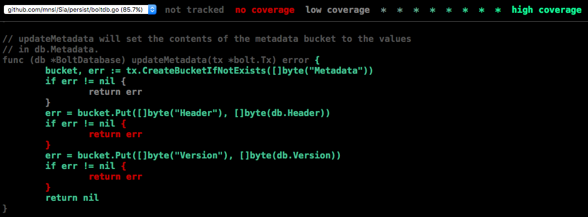

# Running and Writing Tests for Sia
Improving test coverage is a great way to start contributing to Sia.  

This guide focuses on how to write tests.  To learn about making pull requests
to submit the code you've written, see
[doc/Guide to Contributing to Sia.md][guide].  You should also read
[doc/Developers.md][developers] to learn about Sia code conventions and quality
standards.


#### Table of Contents
* [Running tests for Sia](#existing)
  * [Updating code before testing](#update)
  * [Testing the entire build](#entire)
  * [Testing a particular package](#particular)
* [Writing new tests for Sia](#write)
  * [A few guidelines](#naming)
  * [Basic test format](#basic)
  * [Table-driven tests](#table)
* [Questions?](#questions)

<a name="existing"></a>
## Running tests for Sia
Go's comprehensive [test package][pkg/testing] makes testing straightforward,
particularly when you use the bundled tools included in the
[Sia makefile][makefile], including `make test`, `make cover`, `make bench`,
and their variants.

<a name="update"></a>
### Updating code before testing
If you just want to run existing tests on the codebase as is, you just need to
pull the latest version of the original repo to your master branch.  (If that 
sentence didn't make sense, go read
[doc/Guide to Contributing to Sia.md][guide].)

```bash
# Make sure you are in the right directory.
$ cd $GOPATH/src/github.com/<your Github username>/Sia
# Also make sure you're working with the right branch.
$ git checkout master
# Pull latest changes from origin, the original Sia repo. 
$ git pull origin master
# Update your fork of the repo, which should be set up as a remote.
$ git push <remote>  master
```

If you want to run tests on the new code you've added, first make sure the rest
of the code is up to date. New code should be on its own branch (again, see
[doc/Guide to Contributing to Sia.md][guide]).

```bash
# Make sure you are in the right directory.
$ cd $GOPATH/src/github.com/<your Github username>/Sia
# Checkout the branch you made the changes on.
$ git checkout <branch name>
# Stash any tracked but uncommitted changes.
$ git stash
# Then switch back to `master` and update it to match the original repo.
$ git checkout master
$ git pull origin master
# Update your fork of the repo, which you should have set up as a remote.
$ git push <remote>  master
# Make the updated `master` the new base of the branch you made the changes on,
# which involves reapplying all the commits made to that branch.  Without the
# `--ignore-date` flag, git rebase changes the date on all the commits to the
# current date.
$ git checkout <branch name>
$ git rebase master --ignore-date
# Restore the changes you stashed earlier.
$ git stash pop
```
When you call `rebase`, you may run into some merge conflicts.  Luke Champine's
['How to into git and GitHub'][luke] has more details (and many useful tricks).

Once the branch you want to test is up to date, you're ready to run some tests.

<a name="entire"></a>
### Testing the entire build
The `make test` command runs all tests (functions starting with `Test` in
`_test.go` files) for each package, setting off a panic for any test that runs
longer than 5s.  For verbose output, run `make test-v` (which panics after 15s
instead of 5s).  Finally, `make test-long` has verbose output, only panics when
a test takes 5 minutes, and also cleans up your code using `gofmt` and `golint`. 
**You should run** `make test-long` **before each pull request.**

Run `make cover` to run all tests for each package and generate color-coded
.html visualizations of test coverage by function for each source file.  Open
`cover/<module>.html` in a browser to inspect a module's test coverage. For 
example, here's part of the html file generated for the persist package: 



Meanwhile, `make bench` will call `gofmt` on all packages, then run all
benchmarks (functions starting with `Benchmark` in `_test.go` files).

<a name="particular"></a>
### Testing a particular package or function
To run tests for just a certain package, run `make test pkgs=./<package>`. To run 
a certain test function, run `make test pkgs=./<package> run=<function>`. The same
goes for `make test-long`, `make cover` and `make bench`.

For example, running `test-long` on the package persist produces this output:

```bash
$ make test-long pkgs=./persist
rm -rf release doc/whitepaper.aux doc/whitepaper.log doc/whitepaper.pdf
gofmt -s -l -w ./persist
go install ./persist
go vet ./persist
go test -v -race -tags='testing debug' -timeout=300s ./persist -run=Test
=== RUN   TestOpenDatabase
--- PASS: TestOpenDatabase (0.42s)
=== RUN   TestSaveLoad
--- PASS: TestSaveLoad (0.00s)
=== RUN   TestSaveLoadFile
--- PASS: TestSaveLoadFile (0.01s)
=== RUN   TestSaveLoadFileSync
--- PASS: TestSaveLoadFileSync (0.00s)
=== RUN   TestLogger
--- PASS: TestLogger (0.00s)
=== RUN   TestLoggerCritical
--- PASS: TestLoggerCritical (0.00s)
=== RUN   TestIntegrationRandomSuffix
--- PASS: TestIntegrationRandomSuffix (0.01s)
=== RUN   TestAbsolutePathSafeFile
--- PASS: TestAbsolutePathSafeFile (0.00s)
=== RUN   TestRelativePathSafeFile
--- PASS: TestRelativePathSafeFile (0.00s)
PASS
ok  	github.com/NebulousLabs/Sia/persist	1.485s
$
``` 

<a name="write"></a>
## Writing new tests for Sia
When you run `make cover`, you'll notice that many files have pretty low
coverage.  We're working on fixing that, but we could use your help.

<a name="naming"></a>
### A few guidelines
* The test functions for `filename.go` should go in `filename_test.go` in the
    same directory and package.
* A test function name should start with `Test` and clearly convey what is
    being tested.
* You should declare function-specific variables and constants locally (inside
    the test function) instead of globally (outside the test function).  [That 
	holds in general][global], not just for tests.
* As always, code should adhere to the standards and conventions laid out in
    [doc/Developers.md][developers].

<a name="basic"></a>
### Basic test format
Suppose we'd like to test the Bar method belonging to type Foo.  

```go
// TestFoo checks that the Bar method on type Foo responds correctly to a normal
// input and returns the expected error when given a bad input.
func TestFoo(t *testing.T) {
	foo, err := NewFoo()
	if err != nil {
	// If NewFoo failed, we can't continue testing.
	t.Fatal(err)
	}

	// Try a normal input; should succeed.
	err := foo.Bar(3)
	if err != nil {
		// Report the error, but don't abort the test.
		t.Error(err)
	}

	// Try a bad input; should return an error.
	// NOTE: Always prefer to compare to a specific error, rather than 
	// err == nil
	err = Foo.Bar(0)
	if err != errDivideByZero {
		t.Errorf("expected errDivideByZero, got %v", err)
	}
}

```

<a name="table"></a>
### Table-driven tests in Go
If you're looking to test a bunch of inputs, write a [table-driven test][table]
with a slice of anonymous structs. For example, see `TestParseFileSize` in 
[siac/parse_test.go][parse_test]:

```go
func TestParseFilesize(t *testing.T) {
	// Define a table of test cases in the form of a slice of anonymous structs.
	tests := []struct {
		in, out string
		err     error
	}{
		{"1b", "1", nil},
		{"1KB", "1000", nil},
		{"1MB", "1000000", nil},
		{"1GB", "1000000000", nil},
		{"1TB", "1000000000000", nil},
		{"1KiB", "1024", nil},
		{"1MiB", "1048576", nil},
		{"1GiB", "1073741824", nil},
		{"1TiB", "1099511627776", nil},
		{"", "", errUnableToParseSize},
		{"123", "123", nil},
		{"123TB", "123000000000000", nil},
		{"123GiB", "132070244352", nil},
		{"123BiB", "", errUnableToParseSize},
		{"GB", "", errUnableToParseSize},
		{"123G", "", errUnableToParseSize},
		{"123B99", "", errUnableToParseSize},
		{"12A3456", "", errUnableToParseSize},
		{"1.23KB", "1230", nil},
		{"1.234KB", "1234", nil},
		{"1.2345KB", "1234", nil},
	}
	// Loop through the table of test cases to make sure ParseFileSize returns 
	// the expected output and error for each.
	for _, test := range tests {
		res, err := parseFilesize(test.in)
		if res != test.out || err != test.err {
			t.Errorf("parseFilesize(%v): expected %v %v, got %v %v", test.in, test.out, test.err, res, err)
		}
	}
}
```
<a name="questions"></a>
## Questions?
Read these if you haven't already:
* [doc/Guide to Contributing to Sia.md][guide]: getting started with Go, Sia,
    and git
* [doc/Developers.md][developers]: conventions and quality standards for Sia
    code

Some other useful resources, some of which have been linked to already:
* [Golang.org page on the go testing package][pkg/testing]
* [Writing Table-Driven Tests in Go][table]
* [How to Write Benchmarks in Go][cheney-benchmarks]
* [How to into git and GitHub][luke]: an essential introduction to git

And feel free to ask questions on the [#dev channel][slack] on the Sia Slack. 
Odds are, someone else is wondering the same thing.

[pkg/testing]: https://golang.org/pkg/testing/
[makefile]: https://github.com/NebulousLabs/Sia/blob/master/Makefile
[luke]: https://gist.github.com/lukechampine/6418449
[guide]: https://github.com/NebulousLabs/Sia/blob/master/doc/Guide%20to%20Contributing%20to%20Sia.md
[developers]: https://github.com/NebulousLabs/Sia/blob/master/doc/Developers.md
[table]: http://dave.cheney.net/2013/06/09/writing-table-driven-tests-in-go
[boltdb_test.go]: https://github.com/NebulousLabs/Sia/blob/master/persist/boltdb_test.go
[cheney-benchmarks]: http://dave.cheney.net/2013/06/30/how-to-write-benchmarks-in-go
[pkg/testing]: https://golang.org/pkg/testing/
[slack]: https://siatalk.slack.com/messages/dev/
[parse_test]: https://github.com/NebulousLabs/Sia/blob/master/siac/parse_test.go
[global]: http://c2.com/cgi/wiki?GlobalVariablesAreBad
